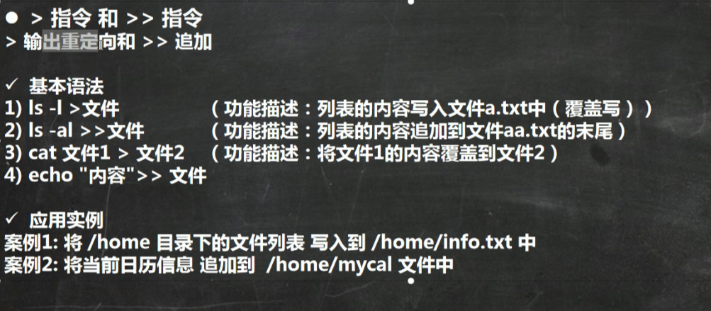
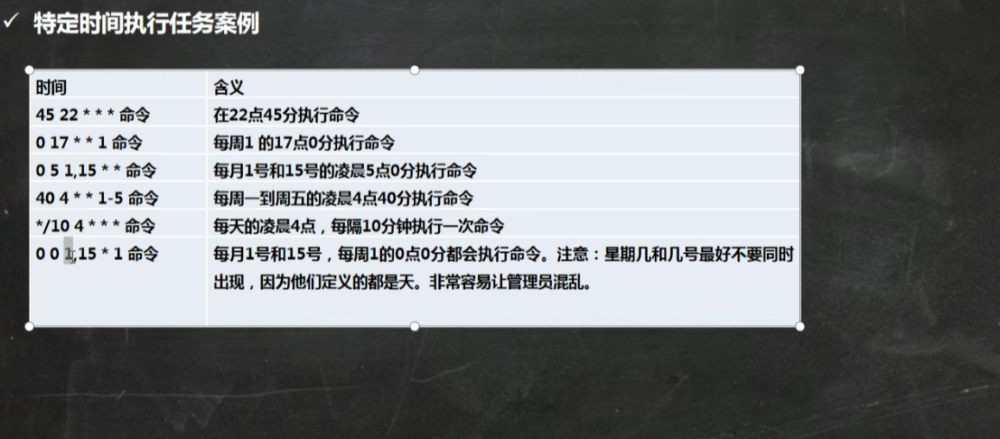

# Linux

## vim

### vim的三种模式

- 正常模式

以vim打开一个档案就直接进入一般模式了(这是默认的模式)。在这个模式中，你可以使用【上下左右】按键来移动光标，你可以使用【删除字符】或【删除整行】来处理档案内容，也可以使用【复制、粘贴】来处理你的文件数据。

- 插入模式

按下``` i,I,o,O,a,A,r,R```等任何一个字母之后才会进入编辑模式，一般来说按`i`即可

- 命令行模式

先输入ESC退出 再输入:进入命令行模式

在这个模式当中，可以提供你相关指令，完成读取，存盘，替换、离开vim、显示行号等的动作则是在此模式中达成的！

### vim快捷键

> :wq(保存并退出)
>
> :q(退出)
>
> :q!(强制退出，不保存)

- 快捷键使用练习(以下操作需要在一般模式下才能使用 编辑模式无效)


## 用户管理

### 关机&重启命令

- 基本介绍

`shutdown -h now` 立刻进行挂机

`shutdown -h 1`  1minutes后关机

`shutdown -r now`  现在重启计算机

`halt`  关机

`reboot`  现在重启计算机

`sync`  把内存的数据同步到磁盘

- 注意细节

1、不管是重启系统还是关闭系统，首先要运行sync命令，把内存中的数据写到磁盘中

2、目前的shutdown/reboot/halt等命令均已经在关机前进行了sync

### 指定/修改密码

- 基本语法

>  passwd 用户名

- 应用案例

给milan指定密码

> 补充，显示当前用户所在的目录 pwd

### 删除用户

- 基本语法

> userdel 用户名

- 应用案例

1. 删除用户milan，但是要保留home目录 `userdel milan`
2. 删除用户以及用户主目录，比如Tom `userdel -r tom`

- 细节说明

是否保留home目录的讨论？

> 注：一般情况下，建议保留

### 查询用户信息指令

- 基本语法

> id 用户名

- 应用案例

案例：查询root 信息

- 细节说明

当用户不存在时，返回无此用户

### 切换用户

- 介绍

在操作Linux中，如果当前用户的信息权限不够，可以通过su - 指令，切换到高权限用户，比如root

- 基本语法

su - 切换用户名

- 应用实例

创建一个用户jack，指定密码，然后切换到jack

- 细节说明

1. 从权限高的用户切换到权限低的用户，不需要输入密码，反之需要。
2. 当需要返回到原来用户时，使用exit/logout指令

### 查看当前用户信息/登出用户

- 基本语法

whoami/who am I

### 用户组

- 介绍

类似于角色，系统可以对有共性/权限的多个用户进行统一的管理

- 新增组

指令：`groupadd 组名`

- 删除组

指令(基本语法)：groupadd 组名

案例演示

- 增加用户时直接加上组

指令(基本语法)：useradd -g 用户组 用户名

增加一个用户 zwj，直接将他指定到 wudang

```
groupadd wudang
useradd -g wudang zwj //增加一个用户，同时将这个用户放到wudang这个组
```


- 修改用户的组

指令：`usermod -g 用户组 用户名`

案例演示

创建一个组mojiao

把zwj放入到mojiao

### 用户和组相关文件

- /etc/passwd 文件

用(user)的配置文件，记录用户的各种信息

每行的含义：用户名：口令：用户标识号：组标识号：注释性描述：主目录：登录Shell


- /etc/shadow 文件

口令的配置文件

每行的含义：登录名:加密口令:最后一次修改时间:最小时间间隔:最大时间间隔:警告时间:不活动时间:失效时间:标志


- /etc/group

查看所有组及组内成员

组(group)的配置文件，记录Linux包含的组的信息

每行含义：组名:口令:组标识号:组内用户列表

## 运行级别


### 指定运行级别


## 找回root密码


## 帮助指令


> 注：隐藏的文件是以 . 开头的，如果创建一个隐藏文件 则以 . 开头即可

## 文件目录指令

### cd指令


> 使用相对路径到/root目录， 比如当前绝对路径为/home/tom 则使用`cd../../root`即可到/root目录

### mkdir指令

mkdir 用于创建目录

基本语法：mkdir [选项] 要创建的目录

- 常用选项

> -p：创建多级目录

- 案例

案例1：创建一个目录 /home/dog

```
mkdir /home/dog
```


案例2：创建多级目录/home/animal/tiger

```
mkdir -p /home/animal/tiger
```


> 注：mkdir 默认只能创建一级目录，如果要创建多级目录使用指令 mkdir -p

### rmdir指令

删除空目录

- 基本语法

rmdir [选项] 要删除的空目录

- 应用实例

案例：删除一个目录 /home/dog

- 使用细节

rmdir 删除的是空目录，如果目录下有内容时是无法删除的。

提示：如果需要删除非空目录，需要使用 `rm -rf 要删除的目录`

比如：rm -rf /home/animal

### touch指令

touch指令创建空文件

- 基本语法

touch 文件名称

- 应用实例

创建一个空文件 hello.txt

` touch hello.txt`

### 拷贝指令

- cp指令

cp 指定拷贝文件到指定目录

- 基本语法

cp [选项] source dest

- 常用选项

-r：递归复制整个文件夹

- 应用实例

案例1：将/home/hello.txt 拷贝到 /home/bbb 目录下

`cp hello.txt /home/bbb`

案例2：递归复制整个文件夹，举例，比如将/home/bbb整个目录，拷贝到/opt

`cp -r /home/bbb /opt`

> 细节：强制覆盖不提示的方法：\cp , \cp -r /home/bbb/opt 强制覆盖且不提示

### rm指令

说明：rm指令移除文件或目录

- 基本语法

rm [选项] 要删除的文件或目录

- 常用选项

-r：递归删除整个文件夹 /home/bbb

-f：强制删除不提示

- 应用实例

案例1：将/home/hello.txt删除，rm /home/hello.txt

案例2：递归删除整个文件夹/home/bbb, rm -rf /home/bbb [删除整个文件夹，不提示]

> 细节：强制删除不提示的方法：带上 -f 参数即可


### mv指令

mv 移动文件与目录或重命名

- 基本语法

mv oldNameFile newNameFile (功能描述：重命名)

mv /temp/movefile /targetFolder (功能描述：移动文件)


- 应用实例

案例1：将/home/cat.txt 文件 重新命名为 pig.txt

案例2：将/home/pig.txt 文件移动到 /root 目录下

> 移动指令：mv /home/pig.txt /root         移动并重命名指令：mv /home/pig.txt /root/cat.txt

案例3：移动整个目录，比如将 /opt/bbb，移动到 /home下

mv /opt/bbb/ /home/


### cat指令

cat 查看文件内容（只能查看不能修改，建议查看重要文件时用cat)

- 基本语法

cat [选项] 要查看的文件

- 常用选项

-n：显示行号

- 应用实例

案例1：/etc/profile 文件内容，并显示行号

> 细节：cat只能浏览文件，不能修改文件，为了浏览方便，一般会带上 管道命令 | more (将前面处理的结果交给后面的命令继续执行)

`cat -n /etc/profile | more [进行交互]`


### less指令


### echo指令

echo输出内容到控制台

- 基本语法

echo [选项] [输出内容]

- 应用实例

案例：使用echo 指令输出环境变量，比如输出 $PATH $HOSTNAME   `echo $PATH`

案例：使用echo 指令输出 hello,world!


### head指令

head用于显示文件的开头部分内容，默认情况下head指令显示问价的前10行内容

- 基本语法

head 文件 (功能描述：查看文件头10行内容)

head -n 5 文件 (功能描述：查看文件头5行内容，5可以是任意行数)

- 应用实例

案例：查看/etc/profile 的前5行代码

head -n 5 /etc/profile

### tail指令


> 监控指令：tail -f /home/mydate.txt

### > 指令 和 >> 指令



> 注意：> 表示覆盖操作，>> 表示追加操作，不会覆盖目标文件，只会在文件末尾追加

### 	ln 指令


### history指令

查看已经执行过历史命令，也可以执行历史指令

- 基本语法

history(功能描述：查看已经执行过历史命令)

- 应用实例

案例1：显示所有的历史命令

`history`

案例2：查看最近使用过的10个指令

`history 10`

案例3：执行历史编号为5的指令

`!5`

## date指令-显示当前日期

- 基本语法

1.date					显示当前时间

2.date +%Y	       显示当前年份

3.date +%m	 	显示当前月份

4.date +%d	  	显示当前是那一天

3.date "+%Y-%m-%d %H:%M:%S"	  显示年月日时分秒


### 设置日期

> date -s 字符串时间

案例1：设置系统当前时间，比如设置成2020-11-03 20:02:10

`date -s "2020-11-03 20:02:10"`

### cal指令

查看日历

- 基本语法

cal [选项] (不加选项显示本月日历)

## 查找指令

### find指令

find指令将从指定目录向下递归地遍历其各个子目录，将满足条件的文件或目录显示在终端

- 基本语法

find [搜索范围] [选项]

> 选项说明：
>
> -name<查询方式> 		按照指定的文件名查找模式查找文件
>
> -user<用户名>			   查找属于指定用户名所有文件
>
> -size<文件大小>			按照指定的文件大小查找文件。

- 应用案例

案例1：按文件名：根据名称查找/home目录下的hello.txt文件

`find /home -name hello.txt`

案例2：按拥有者：查找/opt目录下，用户名称为nobody的文件

`find /opt -user nobody`

案例3：查找整个linux系统下大于200M的文件(+n 大于 -n 小于 n等于，单位有k,M,G)

`find / -size +200M`


### locate指令

locate指令可以快速定位文件路径。locate指令利用事先建立的系统中所有文件名称及路径的locate数据库实现快速定位给定的文件。Locate指令

无需比那里整个文件系统，查询速度较快。为了保证查询结果的准确度，管理员必须定期更新locate时刻

- 基本语法

locate 搜索文件

> 特别说明：由于locate指令基于数据库进行查询，所以第一次运行前，必须使用updatedb指令创建locate数据库

- 应用实例

案例1：请使用locate指令快速定位hello.txt文件所在目录

```
	
updatedb

locate hello.txt
```

### which指令

可以查看某个指令在哪个目录下

案例：查找ls指令在哪个目录下

`which ls`


### grep指令和管道符 |

grep 过滤查找，管道符，“|”，表示将前一个命令的处理结果输出传递给后面的命令处理。

- 基本语法

grep [选项] 查找内容 源文件

- 常用选项

> -n	显示匹配行及行号
>
> -i	 忽略字母大小写

- 应用案例

在hello.txt文件中，查找"yes"所在行，并且显示行号

写法1：cat /home/hello.txt |grep -n "yes"

写法2：grep -n "yes" /home/hello.txt

## 压缩和解压

### gzip/gunzip 指令

gzip用于压缩文件，gunzip用于解压的

- 基本语法

gzip文件		(功能描述：压缩文件，只能将文件压缩为*.gz文件)

gunzip 文件.gz	(功能描述：解压缩文件命令)

- 应用实例

案例1：gzip压缩，将/home下的hello.txt文件进行压缩

gzip /home/hello.txt

案例2：gunzip压缩，将/home下的hello.txt.gz文件进行解压缩

gunzip /home/hello.txt.gz


### zip/unzip 指令


案例1：将/home下的 所有文件/文件夹进行压缩成 myhome.zip

>  zip -r myhome.zip /home/ (将home目录及其包含的文件和子文件夹都压缩)

案例2：将 myhome.zip 解压到 /opt/tmp 目录下

> mkdir /opt/tmp
>
> unzip -d /opt/tmp   /home/myhome.zip

### tar 指令


案例1：压缩多个文件，将/home/pig.txt 和 /home/cat.txt 压缩成pc.tar.gz

> tar -zcvf pc.tar.gz /home/pig.txt /home/cat.txt

案例2：将/home 的文件夹 压缩成 myhome.tar.gz

>  tar -zcvf myhome.tar.gz /home/

案例3：将pc.tar.gz 解压到当前目录，切换到 /opt/

> tar -zxvf pc.tar.gz

案例4：将myhome.tar.gz 解压到 /opt/tmp2目录下

> mkdir /opt/tmp2
>
> tar -zxvf  /home/myhome.tar.gz -C /opt/tmp2

## Linux组管理和权限管理

### 基本介绍

在linux中的每个用户必须属于一个组，不能独立于组外。

在linux中**每个文件有所有者**、所在组、其他组的概念。

1、所有者

2、所在组

3、其他组

4、改变用户所在组

 示意图：


a.txt是tom创建的，那么tom是a.txt的所有者，tom是属于组1的，所以组1里面的成员对a.txt也有一定的权限

组2对于a.txt而言 就是其他组，其他组对a.txt也有一定的权限

### 查看文件所有者

- 查看文件所有者

指令：ls -ahl

- 修改文件所有者

指令：chown 用户名 文件名

- 应用案例

要求：使用root创建一个文件apple.txt，然后将其所有者修改成tom

> touch apple.txt
>
> chown tom apple.txt


### 组的创建

- 基本指令

> groupadd 组名

- 应用实例

创建一个组，monster

>  groupadd monster

创建一个用户fox，并放入到 monster组中

> useradd -g monster fox

### 文件/目录 所在组

当某个用户创建了一个文件后，这个文件的所在组就是该用户所在的组。

- 查看文件/目录所在组

> 基本指令：ls -ahl

- 应用实例

使用fox来创建一个文件，看看该文件属于哪个组

> 文件属于fox所在的monster组

- 修改文件所在组

> 基本指令：chgrp 组名 文件名

- 应用实例

使用root用户创建文件 orange.txt，看看当前这个文件属于哪个组，然后将这个文件所在组，修改到fruit组。

> groupadd fruit
>
> touch orange.txt
>
> 看看这个文件属于哪个组 -> root组
>
> chgrp fruit orange.txt

### 改变用户所在组

在添加用户时，可以指定将该用户添加到哪个组中，同样的用root的管理权限可以改变某个用户所在的组

- 改变用户所在组

> 1、usermod -g 组名 用户名
>
> 2、usermod -d 目录名 用户名 改变该用户登录的初始目录。

- 应用实例

将zwj这个用户从原来所在组，修改到wudang组

## 权限的基本介绍

ls -l 中显示的内容如下：

```
-rwxrw-r-- 1 root root 1213 Feb 2 09:39 abc
```

0-9位说明

> 1、第0位(-)确定文件类型(d, - , l , c , b)
>
> \- 是普通文件
>
> l 是链接，相当于windows的快捷方式
>
> d 是目录，相当于windows的文件夹
>
> c 是字符设备文件，鼠标，键盘
>
> b 是块设备，比如硬盘
>
> 2、第1-3位(rwx)确定所有者(该文件的所有者)拥有该文件的权限。 ---User
>
> 3、第4-6位(rw-)确定所属组(同用户组的)拥有该文件的权限，---Group
>
> 4、第7-9位(r--)确定其他用户拥有该文件的权限 ---Other

### rwx权限详解，难点

- rwx作用到文件

1、[r] 代表可读

2、[w] 代表可写：可以修改，但是不代表可以删除该文件，**删除一个文件的前提条件是对该文件所在的目录有写权限，才能删除该文件**

3、[x] 代表可执行(execute)

- rwx作用到目录

1、[r] 代表可读：可以读取，ls查看目录内容

2、[w] 代表可写：可以修改，对目录内创建+删除+重命名目录

3、[x] 代表可执行：可以进入该目录


### 修改权限-chmod

- 基本说明：通过chmod指令，可以修改文件或者目录的权限


- 第一种方式：+、-、= 变更权限

u：所有者 g：所有组 o：其他人 a：所有人(u、g、o的总和)

```
1.chmod u=rwx,g=rx,o=x 文件/目录名
2.chmod o+w 文件/目录名
3.chmod a-x 文件/目录名
```

案例演示：

1. 给abc文件的所有者读写执行的权限，给所在组读执行权限，给其他组读执行权限。

> chmod u=rwx,g=rx,o=rx abc

1. 给abc文件的所有者除去执行的权限，增加组写的权限

> chmod u-x,g+w abc

1. 给abc文件的所有用户添加读的权限

> chmod a+r abc

- 第二种方式：通过数字变更权限


### 修改文件所有者

- 基本介绍

chown newowner 文件/目录 改变所有者

chown newowner:newgroup 文件/目录 改变所有者和所在组

-R 如果是目录 则使其下所有子文件或目录递归生效

- 案例演示

请将 /home/abc.txt文件的所有者修改成 tom

> chown tom /home/abc.txt

请将 /home/kkk 目录下所有的文件和目录的所有者都修改成tom

> chown -R tom /home/kkk

### 修改文件/目录所在组 -chgrp

- 基本介绍

chgrp newgroup 文件/目录 【改变所在组】

- 案例演示

请将 /home/abc.txt 文件的所在组修改成 shaolin(少林)

> chgrp shaolin /home/abc.txt 

请将/home/kkk目录下所有的文件和目录的所在组修改成shaolin(少林)

> chgrp -R shaolin /home/kkk

## 警察与土匪案例


## crond 任务调度

crontab 进行 定时任务的设置

- 概述

任务调度：是指系统在某个事件执行的特定的命令或程序。

任务调度分类：1.系统工作：有些重要的工作必须周而复始地执行。如病毒扫描

个别用户工作：个别用户可能希望执行某些程序，比如mysql数据库的备份

- 基本语法

crontab [选项]

- 常用选项

> -e		编辑crontab定时任务
>
> -l		查询crontab任务
>
> -r		删除当前用户所有的crontab任务


### 执行案例



- 应用实例

案例1：每隔1分钟，就将当前的日期信息，追加到 /tmp/mydate 文件中

>  */1 * * * * date >> /tmp/mydate

案例2：每隔1分钟，将当前日期和日历都追加到 /home/mycal 文件中

> 步骤：
>
> 1. vim /home/my.sh 写入内容 date >> /home/mycal 和 cal >> /home/mycal
> 2. 给 my.sh 增加执行权限，chmod u+x /home/my.sh
> 3. crontab -e 增加 */1 * * * * /home/my.sh		(/home/my.sh是要执行的脚本)

案例3：每天凌晨2:00 将mysql数据库 tetsdb，备份到文件中。提示：指令为

mysqldump -u root -p密码 数据库 >> /home/db.bak

> 步骤：
>
> 1. crontab -e
> 2. 0 2 * * * mysqldump -u root -proot testdb > /home/db.bak

- crond 相关指令

> crontab -r		终止任务调度
>
> crontab -l		列出当前有哪些任务调度
>
> service crond restart	[重启任务调度]

### 脚本流程图


## at定时任务

- 基本介绍

1. at命令是一次性定时计划任务，at的守护进程atd会以后台模式运行，检查作业队列来运行
2. 默认情况下，atd守护进程每60秒检查作业队列，有作业时，会检查作业运行时间，如果时间与当前时间匹配，则运行此作业。
3. at命令是一次性定时计划任务，执行完一个任务后不再执行此任务了
4. 在使用at命令的时候，一定要保证atd进程的启动，可以使用相关指令来查看

> 指令：ps -ef 用于检测当前正在运行的程序有哪些
>
> ps -ef | grep atd 用于检测atd程序是否在运行 

- at命令格式

> at [选项] [时间]
>
> Ctrl + D 结束at命令的输入

- at命令选项

> -m	当指定的任务被完成后，将给用户发送邮件，即使没有标准输出
>
> -I		atq的别名
>
> -d		atrm的别名
>
> -v		显示任务将被执行的时间
>
> -c		打印任务的内容到标准输出
>
> -V		显示版本信息
>
> -q <队列>		使用指定的队列
>
> -f <文件>		从指定文件读入任务而不是从标准输入读入
>
> -t <时间参数>	以时间参数的形式提交要运行的任务

- at时间的指定


- 应用案例


案例1：

> at 5pm + 2 days
>
> at> /bin/ls /home
>
> ctrl + D (输入两次)

案例2：

> atq

案例3：

> at 5:00pm tomorrow
>
> at> date > /root/date100.log

案例4：

> at now + 2 minutes
>
> at> time > /root/date200.log

案例5：

atrm 3  拿掉3号任务

## Linux分区

### 原理介绍

1. Linux来说无论有几个分区，分给哪一个目录使用，它归根结底就只有一个根目录，一个独立且唯一的文件结构，Linux中

每个分区都是用来组成整个文件系统的一部分。

2. Linux采用了一种叫“载入”的处理方法，它整个文件系统中包含了一整套的文件和目录，且**将一个分区和一个目录联系起来**，这时要载入的一个分区将使它的存储空间在一个目录下获得。
3. 示意图


### 硬盘说明


- 查看所有设备挂载情况

命令：lsblk 或者 lsblk -f


### 挂载的经典案例

- 说明：

下面我们以增加一块硬盘为例来熟悉下磁盘的相关指令和深入理解磁盘分区、挂载、卸载的概念。

- 如何增加一块硬盘

1. 虚拟机添加硬盘


2. 分区


3. 格式化


4. 挂载

> mkdir /newdisk
>
> mount /dev/sdb1 /newdisk/

注：命令行挂载的方式 只要重启就会挂载失效

5. 设置可以自动挂载


vim /etc/fstab 去添加sdb1即可实现永久挂载

### 磁盘情况查询

- 查询指定目录的磁盘占用情况

- 基本语法

> du -h

查询指定目录的磁盘占用情况，默认为当前目录

> -s 指定目录占用大小汇总
>
> -h 带计量单位
>
> -a 含文件
>
> --max-depth=1 子目录深度
>
> -c 列出明细的同时，增加汇总值

- 应用实例

查询/opt目录的磁盘占用情况，深度为1

### 磁盘情况-工作实用指令

1. 统计/opt文件夹下文件的个数

> ls -l /opt | grep "^-" | wc -l

2. 统计/opt文件夹下目录的个数

> ls -l /opt | grep "^d" | wc -l

3. 统计/opt文件夹下文件的个数，包括子文件夹里的

> ls -lR /opt | grep "^-" | wc -l

4. 统计/opt文件夹下目录的个数，包括子文件夹里的

> ls -lR | grep "^d" | wc -l

5. 以树状显示目录结构，注意，如果没有tree，则使用yum install tree安装


> 指令：tree 目录

## Linux网络配置原理图

- 原理图


## linux网路环境配置

- 第一种方法(自动获取)：


- 第二种方法(指定ip)

 

> 注：还需要改一下vm虚拟机的Ip地址 使其网段与linux虚拟机保持一致

- 重启网络服务或者重启系统生效

service network restart 、 reboot

## 设置主机名和hosts映射

- 设置主机名

1. 为了方便记忆，可以给linux系统设置主机名，也可以根据需要修改主机名
2. 指令hostname：查看主机名
3. 修改文件在/etc/hostname 指定
4. 修改后，重启生效

- 设置hosts映射

思考：如何通过 主机名能够找到(比如ping)某个linux系统？


## 主机名解析过程分析(Hosts、DNS)


- 应用实例：用户在浏览器输入了www.baidu.com

简单描述：

① 先看浏览器缓存有没有该域名的解析地址，没有走②

② 看电脑本地DNS缓存，如果没有走③

③ 看系统中hosts文件中有没有对应的IP映射，没有走④

④ 去互联网的DNS服务器查找解析，**找不到则返回域名不存在**

## Linux进程

### 基本介绍

1. 在LINUX中，每个执行的程序都称为一个进程。每一个进程都分配一个ID号(pid,进程号)
2. 每个进程都可能以两种方式存在的。**前台与后台**，所谓前台进程就是用户目前的屏幕上可以进行操作的。

后台进程则是实际在操作，但由于屏幕上无法看到的进程，通常使用后台方式执行。

3. 一般系统的服务都是以后天进程的方式存在，而且都会常驻在系统中。知道关机才结束。

### 显示系统执行的进程

- 基本介绍

ps命令是用来查看目前系统中，有哪些正在执行，以及它们执行的情况，可以不加任何参数


- ps详解


- 应用实例


### 终止进程kill和killall


案例1：踢掉某个非法登录用户

> 1.先使用tom登录
>
> 2.使用root用户，输入指令 ps -aux | grep sshd 查看tom的进程id
>
> 3.kill pid

案例2：

> kill sshd对于的进程；
>
> 重启指令： /bin/systemctl start sshd.service

案例3：终止多个gedit

> killall gedit

案例4：强制杀掉一个终端

>  查看终端进程 ps -aux | grep bash
>
> kill -9 进程号

### 查看进程树


## 服务管理

### 介绍

服务(service)本质就是进程，但是是运行在后台的，通常都会监听某个端口，等待其他程序的请求，比如(mysql,sshd 防火墙等)，因此我们又称为守护进程

是Linux中非常重要的知识点。

### 客户端使用linux服务的原理图


### service管理指令

1. service 服务名 [start | stop | restart |reload | status]

2. 在Centos7.0后 **很多服务不再使用service**，而是 sysytemctl
3. service指令管理的服务在 /etc/init.d 查看


### service管理指令案例

请使用service指令，查看，关闭，启动network [注意：在虚拟系统演示，因为网络连接会关闭]

### 查看服务名

方式1：使用setup -> 系统服务 就可以看到全部。


方式2：/etc/init.d 看到service指令管理的服务

ls -l /etc/init.d


> 注：其中*表示自启动，按空格可以选择开启或关闭

### 服务的运行级别

- Linux系统有7种运行级别：常用的是级别3和5


### Centos7后运行级别说明


### chkconfig指令

- 介绍

1. 通过chkconfig 命令可以给服务的各个运行级别设置自 启动/关闭
2. chkconfig 指令管理的服务在 /etc/init.d 查看
3. 注意：Centos7.0 后，很多服务**使用systemctl** 管理


- chkconfig基本语法

① 查看服务 chkconfig  --list [| grep xxx]

② chkconfig 服务名  --list

③ chkconfig --level 5 服务名 on/off


- 案例演示：对network服务 进行各种操作，把network 在3运行级别，关闭自启动

chkconfig --level 3 network off

chkconfig --level 3 network on

> 使用细节：chkconfig重新设置服务后自启动或关闭，需要重启机器reboot生效

### systemctl 管理指令

1. 基本语法：systemctl [start | stop |restart | status] 服务名
2. systemctl指令管理的服务在 /usr/lib/systemd/system 查看

### systemctl设置服务的自启动状态

1. systemctl list-unit-files [ | grep 服务名] (查看服务开机启动状态，grep 可以进行过滤)
2. sytstemctl enable 服务名 (设置服务开机启动)
3. sytstemctl disbale 服务名 (关闭服务开机启动)
4. sytstemctl is-enabled 服务名 (查询某个服务是否是自启动的)


- 应用案例

查看当前防火墙的状况，关闭防火墙和重启防火墙

> systemctl stop firewalld
>
> systemctl start firewalld


> 细节：
>
> 1. 关闭或启用防火墙后，立即生效。 [telnet 测试 某个端口即可]
> 2. 这种方式只是临时生效，当重启系统后，还是回归以前对服务的设置
> 3. 如果希望设置某个服务自启动或关闭永久生效，要使用 sytstemctl [enable|disable] 服务名.

### 打开或者关闭指定端口

在真正的生产环境，往往需要将防火墙打开，但问题来了，如果我们把防火墙打开，那么外部请求数据包就不能跟服务器监听端口通讯。

这时，需要打开指定的端口。比如80、22、8080等，这个又怎么做呢？


### firewall 指令


- 应用案例

1. 启用防火墙，测试111端口是否能 telnet

   > systemctl start firewalld

2. 开放111端口

   > firewall-cmd --permanent --add-port=111/tcp
   >
   > firewall-cmd --reload

3. 再次关闭111端口

   > firewall-cmd --permanent --remove-port=111/tcp

## 动态监控进程

### 介绍

top与ps命令很相似。它们都用来显示正在执行的进程。Top与ps最大的不同之处，在于top在执行一段时间可以更新正在进行的进程。

### 基本语法

top [选项]

### 选项说明


### 参数介绍


> 注：其中%Cpu中：
>
> us：表示用户占用
>
> sy：系统占用
>
> ni：idle 空闲

### 交互操作说明


- 应用案例

案例1：监视特定用户

top：输入此命令，按回车键，查看执行的进程。

U：然后输入“u”回车，再输入用户名，即可。


案例2：终止指定的进程。

top：输入此命令，按回车键，查看执行的进程。

k：然后输入"k"回车，在输入要结束的进程的ID号


案例3：指定系统状态更新的时间(每隔10秒自动更新)

> top -d 10

### 监控网络状态


> netstat -an
>
> netstat -anp

- 查看服务名为 sshd 的服务的信息

> netstat -anp |grep sshd

## rpm和yum包管理

### rmp介绍


### rpm包的简单查询指令及包的基本格式


### rpm包的其他查询指令


### 卸载rmp包


### 安装rpm包


### yum包介绍


