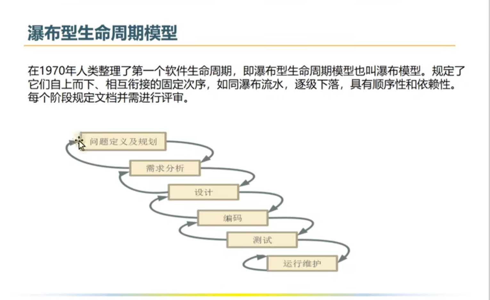
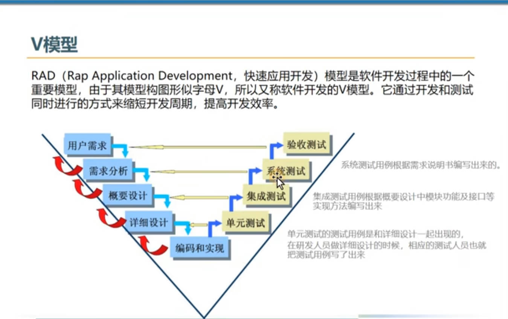
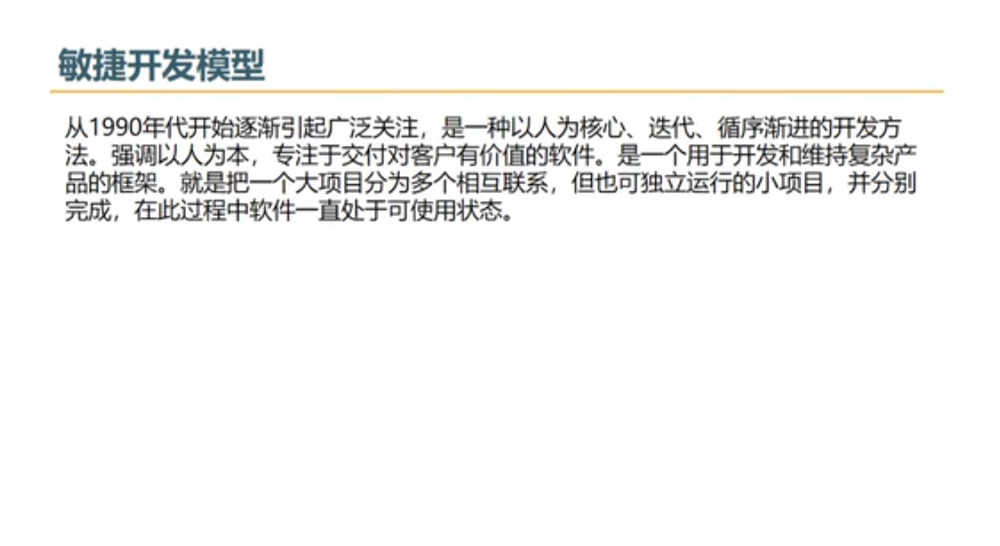
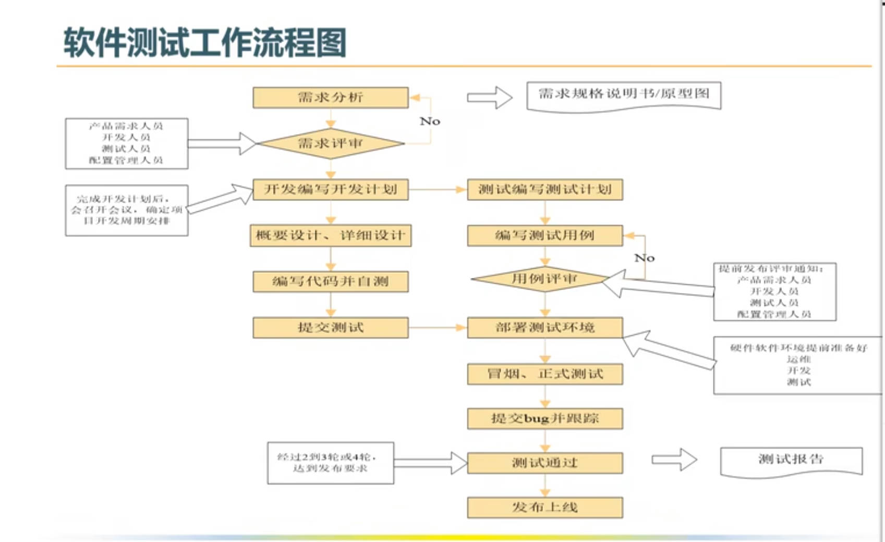
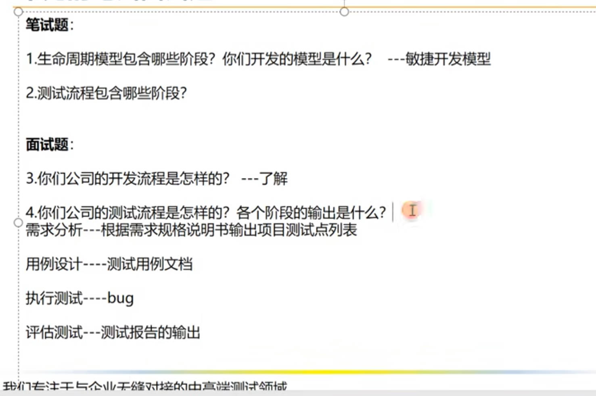
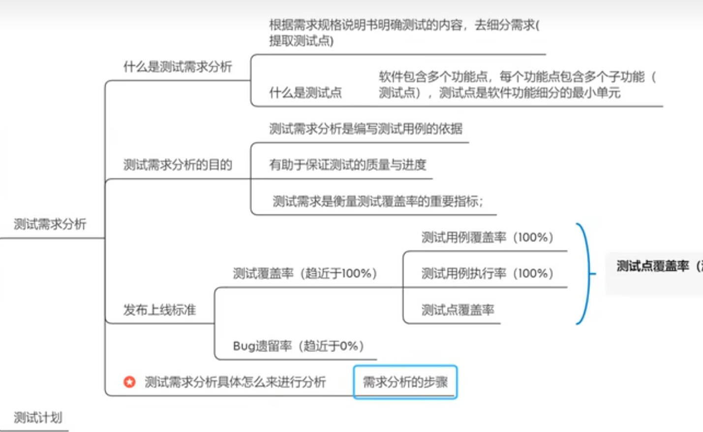
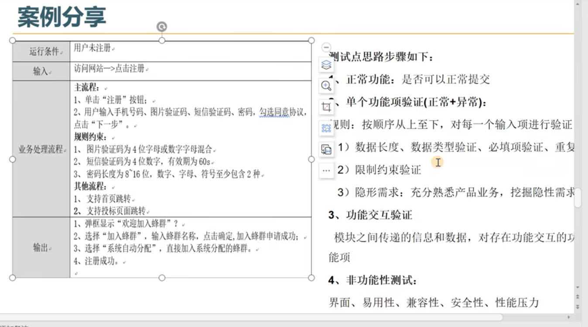

[toc]

# 软件测试

## 软件生命周期模型
软件生命周期：指软件开始研制到最终废弃不用所经历的各个阶段

### 瀑布型生命周期模型

### V模型

### 敏捷开发模型
通过实现一部分功能先上线的方式，逐渐迭代版本

## 软件测试流程图

测试用例：具体怎么来进行测试的文档

灰度测试：先发布部分功能，看用户的反馈然后再发布另外一部分功能的更新

A/B测试：先发布的功能先让A部分的用户进行更新，再根据用户的反馈，再更新B用户对应的功能

预发布环境(UAT环境)：验收测试进行的环境
生产环境：真实用户使用环境

## 软件测试的基本流程
1. 测试需求分析阶段：阅读需求，理解需求，分析需求点

2. 测试计划阶段：主要任务是编写测试计划，参考软件需求规格说明书、项目总体计划、内容包括测试范围(来自需求文档)、进度安排，人力物力的分配，整体测试策略的制定，和风险的评估与规避措施有一个制定。

3. 测试设计阶段：主要任务是编写测试用例，会参考需求文档(原型图)、概要设计、详细设计等文档，有不明确的也会及时和开发、产品经理沟通。

4. 测试执行阶段：首先搭建测试环境，执行预测(冒烟)，以判断当前版本可测与否，如果预测通过，正式进入系统测试，遇到问题提交Bug到缺陷管理平台，并对bug进行跟踪，直到被测软件到测试需求要求，没有重大bug，测试结束

5. 测试评估阶段：出测试报告，对整个测试的过程和版本质量做一个详细的评估。确认是否可以上线。

## 本章面试题

## 测试需求

测试需求应全部覆盖已定义的业务流程，以及功能和非功能方面的需求

功能需求：业务流程
非功能需求：界面、文档、兼容性、安全性、性能、易用性

### 测试需求分析

测试需求分析具体怎么来进行分析:
 1. 初步熟悉被测软件的核心的业务流程
 2. 再针对某个功能，细化需求，列出测试点

### 一个页面如何进行测试需求分析

1. 进行页面检查(参考原型图，查看界面是否一致)

2. 依次分析每一个输入项，按照从上到下，从左到右的顺序来进行分析
    1. 约束条件(长度、格式)
    2. 是否必填
    3. 是否重复
    4. 隐形需求：比如手机号码，需求中没有提及但是应该需要进行验证，需要常识、熟悉业务、根据成熟的同类产品，进而挖掘需求。
3. 按钮
    1. 根据业务逻辑的先后顺序进行依次分析，一般按钮存在(什么条件)操作成功，(什么条件)操作失败，验证操作结果

    2. 需要验证按钮操作结果 验证交互功能(验证关联功能)
       比如登录成功，则跳转到登录成功的界面，展示个人信息

### 案例分享

### 本节面试题
1. 遇到隐性需求怎么办？
充分熟悉产品，参考成熟产品，站在用户的角度去考虑，从而挖掘需求

2. 给你一个带logo的水杯，你会如何去测试？(测试思维)
从功能和非功能出发
功能：能否装水 是否会漏水 是否装热水 冰水 是否保温

非功能：

界面：logo是否与原型图一致 是否美观 是否掉色 材质方面

易用性：是否防滑 防烫 是否带手把 携带是否方便 水杯边缘是否平滑

兼容性：是否可以装其他液体 装其他液体会不会导致水杯产生化学反应

安全性：装热水时，水是否会变有毒

性能：防摔 挤压是否会坏

原则：6大功能，建立测试思维

3. 你会如何去测试朋友圈，购物车等熟知的软件产品。(支付，优惠券，二维码)

## 测试用例

### 测试用例的八大要素
1. 用例编号：产品名-测试阶段-测试项-xxx(英文)或者 项目_编号 用例编号是唯一的
格式：项目_it/st/uat_功能编号/编号/项目_编号
2. 测试项目：对应一个功能模块(细分功能)

3. 测试标题：直接对测试点进行细化得出，输入内容+结果，同一功能模块标题不能重复(来自测试点)

4. 重要级别：高/中/低

5. 预置条件：需要满足一些前提条件，否则用例无法执行

6. 测试输入(数据)：需要加工的输入信息，根据具体情况设计(跟不中欧结合起来一定要具有指导性意义)

7. 操作步骤：明确给出每个步骤的描述，执行人员可以根据该步骤完成执行工作

8. 预期结果：